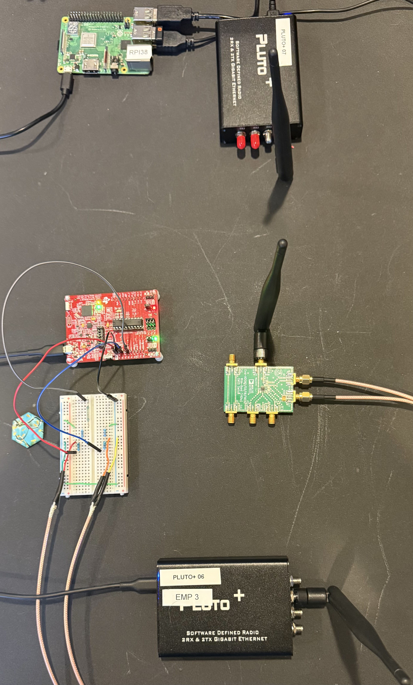
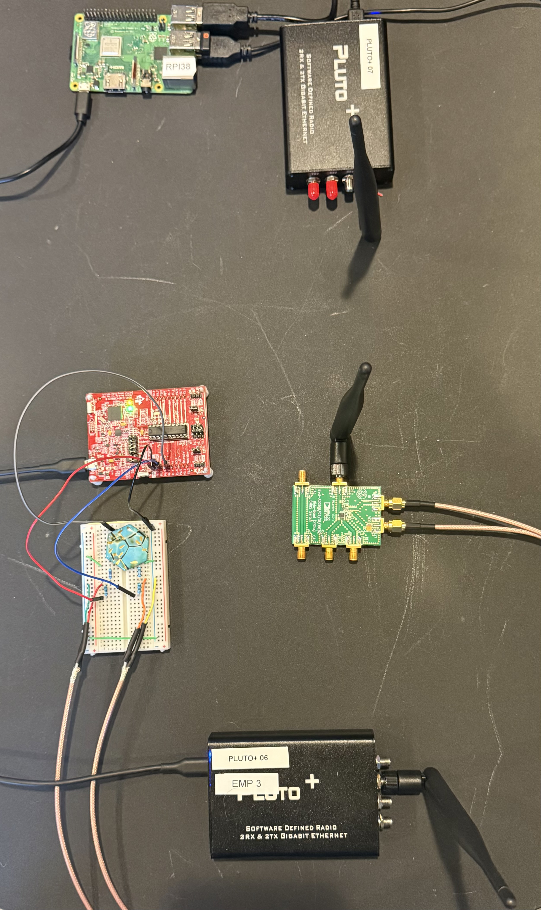
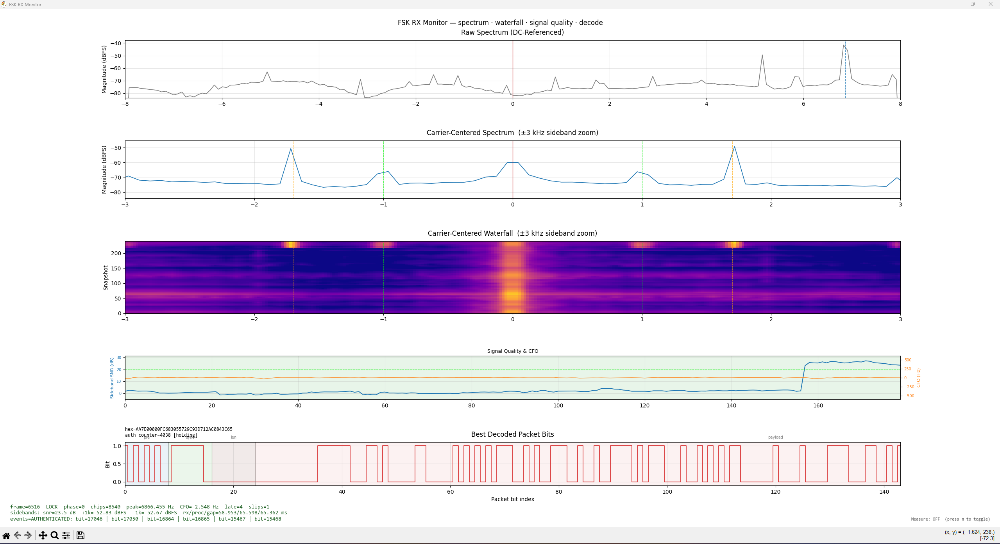
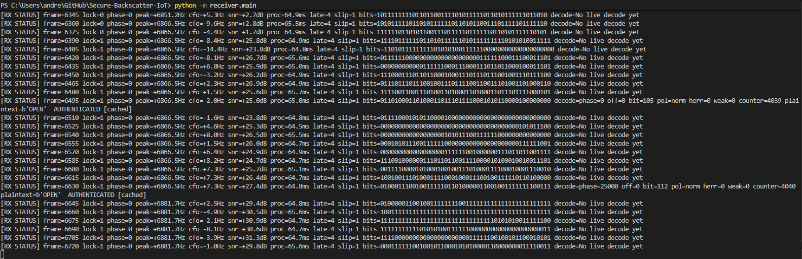
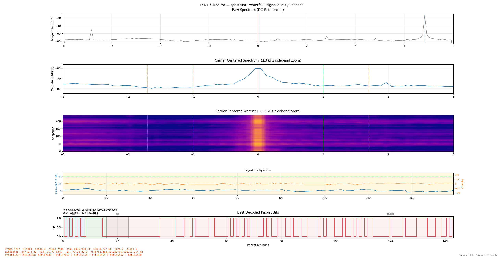
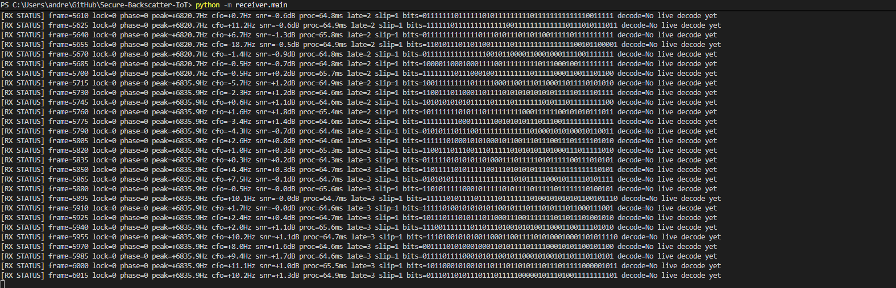
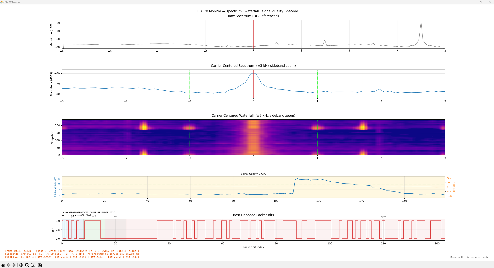
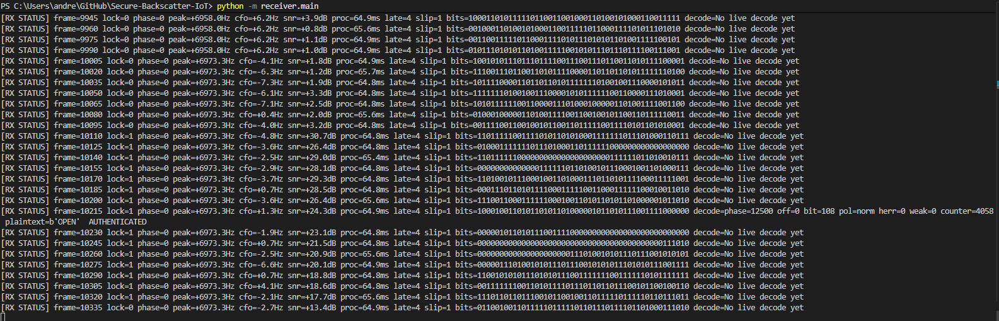
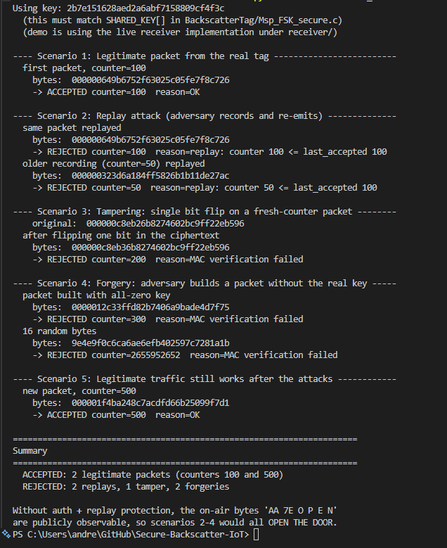
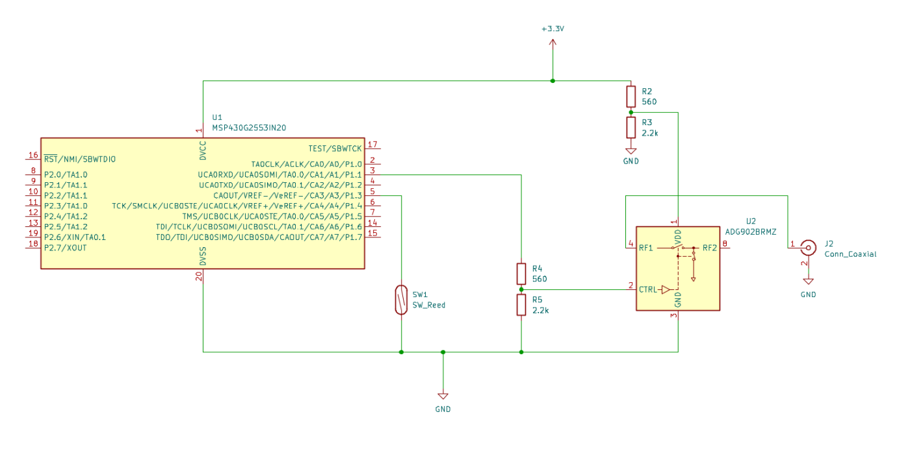

# Secure Backscatter IoT

A research platform for authenticated FSK backscatter communication using
low-power embedded tags (MSP430G2553) and software-defined radios (PlutoSDR).
The system transmits AES-CTR-encrypted, AES-CMAC-authenticated packets over a
passive backscatter link and verifies them in real time on a PC-based SDR
receiver.

**Components:**
- **Tag** (`BackscatterTag/`) — MSP430G2553 firmware generating FSK subcarrier symbols
- **Exciter** (`exciter/`) — PlutoSDR CW transmitter providing the incident carrier
- **Receiver** (`receiver/`) — PlutoSDR SDR stack performing DSP, decoding, and cryptographic verification

---

## Receiver (FSK)

The receiver uses binary FSK backscatter modulation:
- bit `1` at 1.0 kHz subcarrier
- bit `0` at 1.7 kHz subcarrier

Subcarrier frequencies are configured in `receiver/config.py` and generated by
the MSP430 firmware in `BackscatterTag/Msp_FSK_secure.c` [1][2].

This is the canonical active receiver path for the project, including the
current secure packet verification flow.

Run from the repository root:

```bash
python -m receiver.main
```

Optional utilities:

```bash
python -m receiver.rx_monitor
python -m receiver.demo_attacks
```

## Video demo

<p align="center">
  <a href="https://youtu.be/y_z2ynHgnjk">
    
  </a>
</p>

## Hardware setup

The end-to-end link uses three independent radios:

- **Exciter** — PlutoSDR on a Raspberry Pi, transmitting CW at
  $f_{LO} + f_{TONE} = 2.48\text{ GHz} + 15{,}625$ Hz. Configured in
  [exciter/pluto_exciter.py](exciter/pluto_exciter.py); started
  automatically on boot via the systemd unit in
  [exciter/pluto_exciter_service.txt](exciter/pluto_exciter_service.txt).
- **Tag** — MSP430G2553 (EXP-G2ET LaunchPad) running
  [BackscatterTag/Msp_FSK_secure.c](BackscatterTag/Msp_FSK_secure.c).
  Timer_A0 drives the backscatter load FET at 1.0 kHz ('1' bits) or
  1.7 kHz ('0' bits). A reed switch on `P1.3` (active-low, internal
  pull-up) gates transmission: open ⇒ transmit `OPEN`, shut ⇒ silent.
- **Receiver** — PlutoSDR on the PC, tuned to the same
  $f_{LO} = 2.48$ GHz, running the
  [receiver/](receiver/) DSP + crypto stack.

The two photos below show the same physical setup with the magnet
actuator in the two reed-switch states:

<p align="center">
  
  &nbsp;&nbsp;
  
</p>
<p align="center">
  <em>Left: door open (tag transmitting) &nbsp;&nbsp; Right: door shut (tag silent)</em>
</p>

## Exciter runtime and functions

The CW exciter lives in `exciter/pluto_exciter.py` and is intended to run on
the Raspberry Pi host connected to the transmit Pluto.

Primary functions:
- `make_waveform(buffer_len, iq_amplitude)`: builds a constant complex IQ
  vector used as a cyclic TX buffer (pure CW at TX LO).
- `main()`: configures Pluto TX (`tx_lo`, sample rate, gain, RF bandwidth,
  cyclic buffer), starts continuous transmission, and handles clean shutdown on
  SIGINT/SIGTERM.

Operational notes:
- The file uses `FREQ_HZ = 2.48e9` and must stay aligned with receiver LO
  configuration in `receiver/config.py`.
- `TX_GAIN_DB` and `IQ_AMPLITUDE` set excitation strength; increase gain
  carefully to avoid overdriving near-field setups.
- For always-on deployment, the systemd setup is documented in
  `exciter/pluto_exciter_service.txt`.

## Deployment workflow

Use this sequence for normal bring-up and operation:

1. Connect the Raspberry Pi exciter host to a stable wall supply.
   On boot, the exciter service starts automatically (systemd unit documented
   in `exciter/pluto_exciter_service.txt`) [8].

2. Power the tag evaluation board from a suitable supply.
   Battery operation is supported; verify DC offset behavior before use.
   Nominal operating voltage is 3.3 V.

3. Control tag transmission via the reed switch input (magnet actuation).

4. Connect the receiver Pluto to the PC and start the receiver stack:
   ```bash
   python -m receiver.main
   python -m receiver.rx_monitor
   ```

For cryptographic validation without SDR hardware, run:
```bash
python -m receiver.demo_attacks
```
`receiver.demo_attacks` exercises the security implementation in
`receiver/secure_packet.py` and demonstrates outcomes for legitimate
traffic, replay, tampering, and forgery attacks.

## Live operation screenshots

### Continuous transmission — door open

Tag is actively transmitting. SNR climbs above the lock threshold, FSK
sidebands are visible at ±1 kHz and ±1.7 kHz in the carrier-centered view,
and the receiver authenticates each packet.

<p align="center"></p>
<p align="center"></p>

### Tag silent — door shut

Reed switch grounded: tag stops modulating. SNR drops below the lock
threshold and no sideband bumps appear. The receiver shows the last
authenticated packet in a held state.

<p align="center"></p>
<p align="center"></p>

### Single transmission — open then shut

SNR profile in the signal-quality panel ramps up as the tag begins
transmitting, the receiver locks and decodes one authenticated packet,
then SNR returns to baseline when the reed switch closes.

<p align="center"></p>
<p align="center"></p>

## Attack demo (offline crypto verification)

`receiver/demo_attacks.py` exercises the live security path in
`receiver/secure_packet.py` without needing the SDR or the tag. It builds
packets in software using the same construction as
`BackscatterTag/Msp_FSK_secure.c` (AES-CTR + AES-CMAC[0:8] + monotonic
counter) and feeds them through the same `SecureReceiver` used at runtime,
so the verdicts shown below are exactly what the live receiver would
produce on air.

<p align="center"></p>

What each scenario shows:

- **Scenario 1 — Legitimate packet.** A fresh packet at `counter=100` is
  accepted. This is the baseline: valid CMAC, monotonic counter, plaintext
  decrypts to `OPEN`.
- **Scenario 2 — Replay attack.** The exact bytes from Scenario 1 are
  re-emitted. The CMAC still verifies (the adversary didn't change
  anything), but the receiver rejects on `counter <= last_accepted`. An
  older capture at `counter=50` is also rejected for the same reason.
  This is the protection that bare `AA 7E O P E N` over OOK would not
  have.
- **Scenario 3 — Tampering.** A single bit is flipped in the ciphertext of
  a fresh-counter packet. CMAC verification fails, so the packet is
  rejected before any decryption result is trusted. Any in-flight bit
  error or active modification produces this outcome.
- **Scenario 4 — Forgery.** The adversary builds a packet with the wrong
  key (all zeros) at `counter=300`, and also tries 16 random bytes. Both
  fail CMAC verification. Without the shared key, the attacker can't
  produce a tag that the receiver will accept, regardless of how
  plausible the counter or ciphertext look.
- **Scenario 5 — Recovery.** A legitimate packet at `counter=500` is still
  accepted after the attacks. Replay/tamper/forgery attempts don't poison
  the receiver state; the monotonic counter just advances past anything
  the attacker tried.

The summary line at the bottom captures the security claim: only the two
genuine packets are accepted; every replay, tamper, and forgery attempt is
rejected. The closing reminder — *"Without auth + replay protection, the
on-air bytes 'AA 7E O P E N' are publicly observable, so scenarios 2–4
would all OPEN THE DOOR"* — is why the link uses authenticated encryption
plus a monotonic counter rather than just transmitting the plaintext
command.

## FSK vs. OOK Design Rationale

- **Chip decision**: differential metric (`m_f1` vs `m_f0`) instead of absolute thresholding.
- **Tone separation**: 1.0 kHz and 1.7 kHz are non-harmonic, reducing overlap.
- **Metrics view**: GUI panel shows both per-chip tone metrics and decision overlay.
- **Robustness focus**: lock/CFO tracking and synchronization-oriented monitoring
  follow practical backscatter receiver themes also discussed in Satori and
  DUNNA [6][7].

## MSP firmware

<p align="center">
  
</p>

The matching MSP430 secure firmware is in `BackscatterTag/Msp_FSK_secure.c`.
It drives Timer_A0 with two
different CCR0 values per bit:
- `CCR0 = 499` for the '1' bit (1 kHz subcarrier)
- `CCR0 = 293` for the '0' bit (1.7 kHz subcarrier)
- Different tick counts per bit (100 for '1', 170 for '0') keep
  wall-clock bit duration constant at 50 ms.

Key MSP430 functions in `Msp_FSK_secure.c`:
- `counter_init()`: loads the persisted monotonic counter from flash and
  advances it by `COUNTER_PERSIST_INTERVAL` to stay monotonic across resets.
- `counter_next()`: returns the current on-air counter and increments state;
  periodically checkpoints to flash.
- `build_packet()`: constructs `AA || 7E || counter || AES-CTR(ciphertext) ||
  CMAC[0:8]`.
- `transmit_bit()` and `transmit_byte()`: emit FSK symbols by switching
  `TA0CCR0` and waiting the correct tick count per symbol.
- `transmit_packet()`: sends the complete packet MSB-first and toggles LED
  indication during transmission.
- `subcarrier_enable()` / `subcarrier_disable()`: gate Timer_A0 output and RF
  backscatter path depending on reed-switch state.
- `main()`: initializes clock/GPIO/crypto, then loops on reed-switch state to
  build/transmit packets with an inter-packet gap.

The live receiver security path is implemented in `receiver/secure_packet.py`
and configured in `receiver/config.py`.

Security construction and checks follow:
- AES-CTR with IV = counter(4-byte big-endian) || 12 zero bytes [2][3][4]
- AES-CMAC over counter || ciphertext, truncated to 8 bytes [2][3][5]
- Monotonic replay rejection using persisted receiver state [3]

Runtime capture/state outputs are written under `receiver/captures/`.
These files are local runtime artifacts and are intentionally ignored by git.

## Tuning

If most chip decisions resolve to 0 (`FSK_F0_HZ` wins), increase
`FSK_DECISION_DEAD_ZONE` to require a stronger margin for a '1' decision, or
verify that the tag produces distinguishable signal at both 1.0 kHz and
1.7 kHz on the spectrum view. Both subcarrier markers (lime for 1 kHz, orange
for 1.7 kHz) are visible in the carrier-detail and waterfall plots for visual
confirmation before deeper decoder investigation.

For broader receiver tuning guidance (synchronization robustness, channel
distortion handling, and practical deployment behavior), see Satori and DUNNA
[6][7].

## Signal Processing and Cryptographic Reference

The following equations define the relationships between the exciter, tag, and
receiver. All three subsystems must agree on the same RF, IF, and bit-rate
constants — any shared parameter must be consistent across all files.

### 1. Carrier and exciter offset

The exciter transmits a CW tone offset from its LO so the receiver can
distinguish it from the receiver's own DC/LO leakage. Both Plutos share
$f_{LO}$, and the offset $f_{TONE}$ is generated by writing a cyclic IQ
buffer of length $N_{buf}$ samples at sample rate $f_s$ with a
single-bin complex tone at bin $k_{TONE}$:

$$
f_{TONE} = \frac{f_s\,k_{TONE}}{N_{buf}}, \qquad
f_{TX} = f_{LO} + f_{TONE}
$$

With the values in [exciter/pluto_exciter.py](exciter/pluto_exciter.py)
($f_s = 1\times 10^6$, $N_{buf} = 4096$, $k_{TONE} = 64$):

$$
f_{TONE} = \frac{1{\times}10^6\cdot 64}{4096} = 15625\ \text{Hz}
$$

This must equal `EXCITER_EXPECTED_HZ` in
[receiver/config.py](receiver/config.py) (15 625 Hz).

**Observed LO offset between Plutos.** The two PlutoSDRs are free-running,
so their LO errors add as a *difference* term. With each unit at
approximately $\pm 5$ ppm and $f_{LO} = 2.48$ GHz:

$$
\Delta f_{LO,max} = (5 + 5)\,\text{ppm}\cdot 2.48{\times}10^9
\approx \pm 24.8\ \text{kHz}
$$

So the maximum relative TX/RX LO mismatch is about $\pm 24.8$ kHz
(worst case, opposite drift directions). The actual peak frequency seen
by the receiver is

$$
f_{peak,RX} = f_{TONE} + (f_{LO,TX} - f_{LO,RX})
$$

In practice, observed offsets are usually smaller than that worst-case
bound. The receiver's argmax-based peak finder locks on the exciter tone
wherever it appears (often several kHz off the nominal +15 625 Hz
design point) and tracks slow thermal drift; the CFO estimator then
derotates the remaining residual before chip slicing.

**Peak-search configuration impact.** Because the nominal tone is
+15 625 Hz and worst-case relative LO mismatch is about $\pm 24.8$ kHz,
the peak can appear up to about $+40.4$ kHz. The receiver therefore uses
`EXCITER_SEARCH_MIN_HZ = 5000` to reject DC/LO leakage and a strict
expected band with `EXCITER_EXPECTED_TOL_HZ = 30000` and
`EXCITER_STRICT_EXPECTED_BAND = True` in
[receiver/config.py](receiver/config.py). The strict band is the binding
constraint on lock acquisition: it confines the peak finder to
$f_{TONE} \pm 30$ kHz, comfortably covering the worst-case $+40.4$ kHz
drift while rejecting unrelated interferers. `EXCITER_SEARCH_MAX_HZ =
5\times 10^6` is set well above Nyquist ($f_s/2 = 500$ kHz) so it never
clips the search before the strict-band gate does.

### 2. Tag subcarrier from MSP430 Timer_A0

`Timer_A0` is clocked from SMCLK = 1 MHz in up-mode with `OUTMOD_4`
(toggle). The output toggles once per CCR0 match, so the
backscatter-load square-wave period is two timer cycles:

$$
f_{sub} = \frac{f_{SMCLK}}{2\,(CCR0 + 1)}
$$

With `CCR0_FOR_1_BIT = 499` and `CCR0_FOR_0_BIT = 293`:

$$
f_1 = \frac{10^6}{2(499+1)} = 1000\ \text{Hz},\qquad
f_0 = \frac{10^6}{2(293+1)} \approx 1700.7\ \text{Hz}
$$

These match `FSK_F1_HZ` and `FSK_F0_HZ` in
[receiver/config.py](receiver/config.py).

### 3. Bit duration on air

`wait_subcarrier_ticks(N)` spins on `CCIFG`, which fires once every
`CCR0 + 1` SMCLK ticks (i.e. once per half-period of the subcarrier).
The bit duration for $N$ ticks at compare value $CCR0$ is therefore:

$$
T_{bit} = \frac{N\,(CCR0+1)}{f_{SMCLK}} = \frac{N}{2\,f_{sub}}
$$

For both bit values:

$$
T_1 = \frac{100\cdot 500}{10^6} = 50\ \text{ms},\qquad
T_0 = \frac{170\cdot 294}{10^6} \approx 49.98\ \text{ms}
$$

The receiver mirrors this with `BIT_DURATION_MS = 50.0`, giving:

$$
N_{chip} = f_s\,T_{bit} = 1{\times}10^6 \cdot 0.050 = 50{,}000\ \text{samples}
$$

### 4. Backscatter sideband geometry

The tag's load modulation multiplies the incident CW carrier by a
square wave at $f_{sub}$, producing odd-harmonic sidebands at
$f_{TX} \pm (2k{-}1)f_{sub}$. The receiver mixes its IQ stream down so
the carrier sits at $f_{TONE}$, then looks for sidebands at
$f_{TONE} \pm f_1$ and $f_{TONE} \pm f_0$ in
[receiver/dsp.py](receiver/dsp.py) `compute_sideband_snr`:

$$
\text{SNR}_{dB} = \max\big(P_{+f_{sub}}, P_{-f_{sub}}\big) - P_{noise}
$$

### 5. Coherent FSK chip metric

After mixing the carrier to DC, the receiver takes the AM envelope
$e[n] = \big|x[n]\,e^{-j 2\pi f_c n / f_s}\big|$ over one chip window of
$N_{chip}$ samples and computes a normalized DFT coefficient at each
candidate subcarrier ($f_1$, $f_0$):

$$
m_f = \frac{\sqrt{2}}{\sigma_e}\,
\Bigg|\frac{1}{N_{chip}}\sum_{n=0}^{N_{chip}-1}
\big(e[n] - \bar{e}\big)\,e^{-j 2\pi f n / f_s}\Bigg|
$$

with $\sigma_e = \sqrt{\tfrac{1}{N_{chip}}\sum_n (e[n]-\bar{e})^2}$.
The factor $\sqrt{2}$ compensates for the half-power split into the
$\pm f$ FFT bins. The chip decision is

$$
\hat{b} = \begin{cases}
1 & m_{f_1} - m_{f_0} > +\delta \\
0 & m_{f_0} - m_{f_1} > +\delta \\
\text{weak} & |m_{f_1} - m_{f_0}| \le \delta
\end{cases}
$$

with $\delta = $ `FSK_DECISION_DEAD_ZONE`. The differential metric is
self-normalising, so absolute amplitude doesn't enter the decision —
only the relative tone strength.

### 6. Residual CFO tracking

After locking the carrier, residual frequency drift is estimated from
the average phase advance between adjacent samples (Kay's estimator)
and removed by a phase-continuous derotator:

$$
\hat{f}_{CFO} = \frac{f_s}{2\pi}\;
\arg\left(\frac{1}{N-1}\sum_{n=1}^{N-1} x[n]\,x^{\ast}[n-1]\right)
$$

A two-pole EMA (`CFO_COARSE_ALPHA`, `CFO_FINE_ALPHA`) smooths this
estimate. Derotation uses

$$
y[n] = x[n]\,e^{-j(\varphi_0 + 2\pi \hat{f}_{CFO} n / f_s)}
$$

with $\varphi_0$ carried across buffers for phase continuity.

### 7. Packet timing budget

The on-air packet is $L_{pkt} = 18$ bytes (`AA 7E` + counter(4) +
ciphertext(4) + CMAC[0:8]). With single-chip transmission:

$$
T_{pkt} = 8\,L_{pkt}\,T_{bit} = 8 \cdot 18 \cdot 50\ \text{ms} = 7.2\ \text{s}
$$

Inter-packet gap `GAP_BETWEEN_PACKETS_MS = 2000` ms gives a packet
cadence of $T_{pkt} + 2.0 = 9.2$ s when the reed switch is held open.

### 8. Cryptographic construction

Per-packet IV (NIST SP 800-38A CTR construction):

$$
\text{IV} = \text{CTR}_{\text{BE}(4)} \,\Vert\, 0^{12\times 8}
$$

Ciphertext over plaintext "OPEN" (4 bytes):

$$
C = P \oplus \mathrm{AES}_{K}\big(\text{IV}\big)\big[0{:}4\big]
$$

Authentication tag (NIST SP 800-38B / RFC 4493 AES-CMAC, truncated to
the leading 8 bytes):

$$
T = \mathrm{CMAC}_{K}\big(\text{CTR} \,\Vert\, C\big)\big[0{:}8\big]
$$

Receiver acceptance rule (in
[receiver/secure_packet.py](receiver/secure_packet.py)) requires all
three to hold:

$$
T \stackrel{?}{=} \mathrm{CMAC}_{K}(\text{CTR}\,\Vert\, C)[0{:}8],\quad
\text{CTR} > \text{CTR}_{last},\quad
\mathrm{AES}^{-1}_{CTR}(C) = \text{"OPEN"}
$$

### 9. Realtime budget and jitter

Each call to `sdr.rx()` returns a fixed-size IQ buffer; the per-frame
processing budget is the wall-clock time that buffer represents:

$$
T_{buf} = \frac{N_{buf,RX}}{f_s}
$$

With `RX_BUFFER_SIZE = 65536` and `SAMPLE_RATE = 1 MS/s`
([receiver/config.py](receiver/config.py)):

$$
T_{buf} = \frac{65{,}536}{1{\times}10^6} = 65.536\ \text{ms}
$$

The receiver loop must therefore complete ingest + DSP + status write in
under $T_{buf}$, otherwise frames pile up. The runtime maintains EMAs
of three quantities — `rx_ms` (USB transfer), `proc_ms` (DSP cost), and
`gap_ms` (wall-clock between frame starts) — and counts a "late frame"
whenever

$$
t_{proc} > \alpha_{late}\,T_{buf}
$$

A frame is also flagged as a "gap slip" when consecutive frame starts
exceed $\alpha_{gap}\,T_{buf}$, indicating the OS scheduler stalled the loop.
Both counters surface in the rx_monitor status line so jitter is
visible at a glance.

With current defaults:
$\alpha_{late} =$ `JITTER_LATE_FACTOR` $= 1.20$ and
$\alpha_{gap} =$ `JITTER_GAP_FACTOR` $= 1.50$.

Effective frame rate when running at budget:

$$
f_{frame} = \frac{1}{T_{buf}} = \frac{1}{0.065536\ \text{s}} \approx 15.26\ \text{frames/s}
$$

Live-decode runs every `LIVE_DECODE_EVERY_FRAMES = 4` frames, so the
worst-case packet-verification latency added by the realtime path is

$$
\Delta t_{decode} \le 4\,T_{buf} \approx 262\ \text{ms}
$$

well under the 2 s inter-packet gap (`GAP_BETWEEN_PACKETS_MS = 2000`),
so each finished packet is verified and reported before the next one
begins on air.

### 10. Waterfall display oversampling

The hot path serializes a fixed `RX_MONITOR_SPECTRUM_BINS = 192` bin
spectrum row per frame to JSON. The decoupled `rx_monitor` viewer
upsamples that row onto a finer display axis using one `np.interp`
per frame, so the waterfall image looks denser without changing the
transported payload or the receiver's per-frame DSP cost.

Display bin count and bin width on the carrier-centered axis (span
$\pm$ `CENTERED_SPAN_HZ` $= \pm 8$ kHz):

$$
N_{disp} = M\,N_{tx},\qquad
\Delta f_{disp} = \frac{2 \cdot 8000}{N_{disp} - 1}
$$

With `WATERFALL_DISPLAY_OVERSAMPLE` $= M = 4$,
`RX_MONITOR_SPECTRUM_BINS` $= N_{tx} = 192$:

$$
N_{disp} = 4 \cdot 192 = 768,\qquad
\Delta f_{disp} = \frac{16{,}000}{767} \approx 20.9\ \text{Hz/bin}
$$

The transported (true) spectral resolution is unchanged at
$\Delta f_{tx} = 16{,}000 / 191 \approx 83.8$ Hz/bin; oversampling
only smooths the visual appearance of the scrolling waterfall.
Per-frame cost in the monitor process is one
$O(N_{disp})$ linear interpolation (~768 ops), which is negligible
compared to the matplotlib blit. Set
`WATERFALL_DISPLAY_OVERSAMPLE = 1` in
[receiver/config.py](receiver/config.py) to disable.

### 11. Sample Rate and Buffer Sizing

The FFT bin width sets the CFO/peak resolution:

$$
\Delta f_{bin} = \frac{f_s}{N_{buf}} = \frac{1{\times}10^{6}}{65536}
\approx 15.26\ \text{Hz}
$$

Dropping $f_s$ from 2 MS/s to 1 MS/s halves the per-sample work in every
stage (DC block, FFT, derotation, chip metric) without changing
$T_{buf}$ or $\Delta f_{bin}$, because $N_{buf}$ was halved in lockstep.
The full RX bandwidth of $\pm f_s/2 = \pm 500$ kHz still comfortably
covers the worst-case $\pm 24.8$ kHz LO mismatch from §1.

The receiver classifies a frame as **late** if its measured processing
time exceeds the budget by `JITTER_LATE_FACTOR`, and as a **gap slip**
if the inter-frame arrival gap exceeds the budget by
`JITTER_GAP_FACTOR`:

$$
\text{late} \iff t_{proc} > \alpha_{late}\,T_{buf},\qquad
\text{slip} \iff t_{gap} > \alpha_{gap}\,T_{buf}
$$

with $\alpha_{late} = 1.20$ and $\alpha_{gap} = 1.50$. The status line
prints running counters; if either grows steadily during operation, the
host can't keep up and decode reliability suffers.

The largest controllable cost in the realtime path is the live-decode
search ([receiver/live_decode.py](receiver/live_decode.py)). It runs
every $N_{ld}$ frames (`LIVE_DECODE_EVERY_FRAMES`), giving a worst-case
decode latency of:

$$
T_{decode}^{max} = N_{ld}\,T_{buf} + 8\,L_{pkt}\,T_{bit}
$$

With $N_{ld} = 4$, $T_{buf} = 65.54$ ms, $L_{pkt} = 18$ bytes,
$T_{bit} = 50$ ms that is about $4\cdot 65.54 + 7200 \approx 7.46$ s
from the *first chip* of a packet to the moment the receiver verifies
the CMAC, well under the inter-packet gap of 2 s after packet end.

Frame-counted cadences must be rescaled inversely with $N_{buf}$ to keep
wall-clock pacing constant:

$$
N_{frames}^{new} = N_{frames}^{old}\cdot\frac{N_{buf}^{old}}{N_{buf}^{new}}
$$

This is why halving the buffer size requires doubling
`RX_ONLY_PEAK_TRACK_EVERY_FRAMES`, `RX_STATUS_EVERY_FRAMES`,
`RX_TERMINAL_STATUS_EVERY_FRAMES`, and `LIVE_DECODE_EVERY_FRAMES`,
and vice versa.

**Buffer sizing constraint.** The chip slicer in
[receiver/receiver_loop.py](receiver/receiver_loop.py)
`_slice_chips_for_phase` consumes whole chips of length
$N_{chip} = f_s\,T_{bit}$ samples from a rolling buffer. It tolerates
$N_{buf} > N_{chip}$ (multiple chips per frame) and
$N_{buf} < N_{chip}$ (multiple frames per chip), but the design point is
$N_{buf} \lesssim N_{chip}$ so chips emerge no later than a few frames
after their air-time:

$$
\frac{N_{chip}}{N_{buf}} = \frac{50{,}000}{65{,}536} \approx 0.76
\ \text{chip/frame}
$$

i.e. a new chip is produced every ~1.3 frames on average, keeping
realtime status fresh.

### 12. End-to-end constant alignment

| Symbol | Tag firmware | Receiver | Exciter |
|---|---|---|---|
| $f_{LO}$ | reflective only | `FREQ_HZ = 2.48e9` | `FREQ_HZ = 2.48e9` |
| $f_s$ | — | `SAMPLE_RATE = 1e6` | `SAMPLE_RATE = 1e6` |
| $f_{TONE}$ | — | `EXCITER_EXPECTED_HZ = 15625` | `TONE_HZ = 15625` |
| $f_1$ | `CCR0_FOR_1_BIT = 499` ⇒ 1000 Hz | `FSK_F1_HZ = 1000` | — |
| $f_0$ | `CCR0_FOR_0_BIT = 293` ⇒ 1700.7 Hz | `FSK_F0_HZ = 1700` | — |
| $T_{bit}$ | `TICKS_PER_*` ⇒ 50 ms | `BIT_DURATION_MS = 50.0` | — |
| $K$ | `SHARED_KEY[]` | `SHARED_KEY_HEX` | — |
| Packet | 18 bytes (`AA 7E` + 4+4+8) | `LIVE_DECODE_PAYLOAD_BYTES = 16` | — |

If any row above stops matching, decode breaks. Touch all three columns
together when changing a shared constant.

## References

[1] `receiver/config.py` (active receiver runtime parameters).

[2] `BackscatterTag/Msp_FSK_secure.c` (on-air packet format and firmware-side
crypto construction).

[3] `receiver/secure_packet.py` (live receiver-side authentication, decryption,
and replay checks).

[4] NIST SP 800-38A (CTR mode recommendation and IV/counter construction).

[5] NIST SP 800-38B and RFC 4493 (AES-CMAC definition and test vectors).

[6] `documents/2025.Satori.pdf`.

[7] `documents/nsdi21-dunna.pdf`.

[8] `exciter/pluto_exciter_service.txt` (RPi systemd auto-start service setup).
